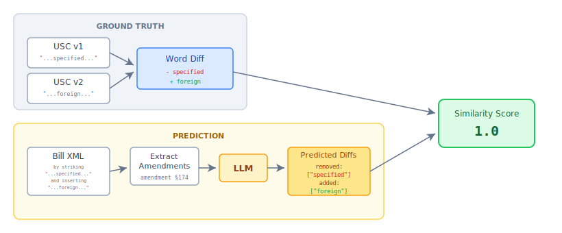

# AI Similarity Scoring

A tool for calculating similarity scores between legislative amendments and actual changes in the US Code.

## The Problem

When comparing two versions of the US Code, computing word-level diffs is straightforward. However, legislative amendments don't come as diffs—they're written in legal prose:

> *"Section 174 is amended--           
    (A) 
    in subsection (a)--
        (i) 
        by striking "a taxpayer's specified research or experimental expenditures" and inserting "a taxpayer's foreign research or experimental expenditures", "*

To match amendments to actual code changes, we need to extract the underlying diff from this natural language.

## The Approach


This tool uses an LLM to "predict" word-level diffs from amendment text. The process:

1. **Parse USC versions** - Load two snapshots of the US Code (XML format)
2. **Compute ground truth diff** - Calculate word-level changes between USC versions using traditional diffing
3. **Parse bill amendments** - Extract individual amendment sections from bill XML
4. **Predict amendment diffs** - Use an LLM to parse amendment prose into structured `{added: [...], removed: [...]}` objects
5. **Calculate similarity** - Score each predicted amendment diff against the actual USC diff

This enables matching amendments to the specific code changes they produced.


## Installation

Requires Python 3.14+.

```bash
uv sync
```

## Usage

```bash
uv run main.py \
    --old-usc samples/usc26-2025-07-18.xml \
    --new-usc samples/usc26-2025-07-30.xml \
    --old-date 2025-07-18 \
    --new-date 2025-07-30 \
    --bill samples/hr-119-21.xml \
    --base-url http://localhost:8080
```

The `--base-url` should point to an OpenAI-compatible chat completions API.

### Options

| Option | Description |
|--------|-------------|
| `--old-usc` | Path to older USC XML file |
| `--new-usc` | Path to newer USC XML file |
| `--old-date` | Date of old USC version |
| `--new-date` | Date of new USC version |
| `--bill`, `-b` | Bill XML file (repeatable for multiple bills) |
| `--base-url` | OpenAI-compatible API endpoint |
| `--use-cache` | Resume from cached progress |
| `--similarity-cutoff` | Minimum score to include (default: 0.4) |
| `--output-dir`, `-o` | Output directory (default: `output`) |

## Output

Results are saved to `output/similarity_scores.json` containing amendments ranked by their similarity to actual USC changes.

## Results So Far

Currently tested with Gemma 4 30B